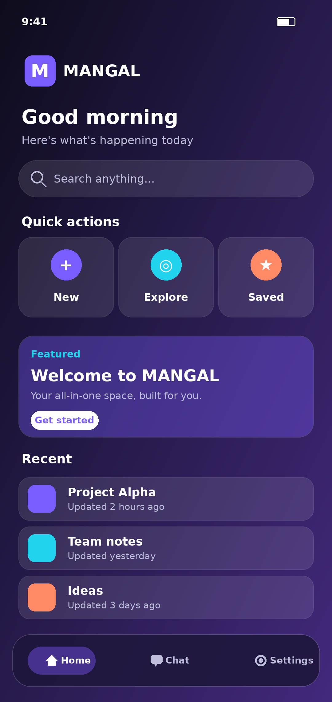
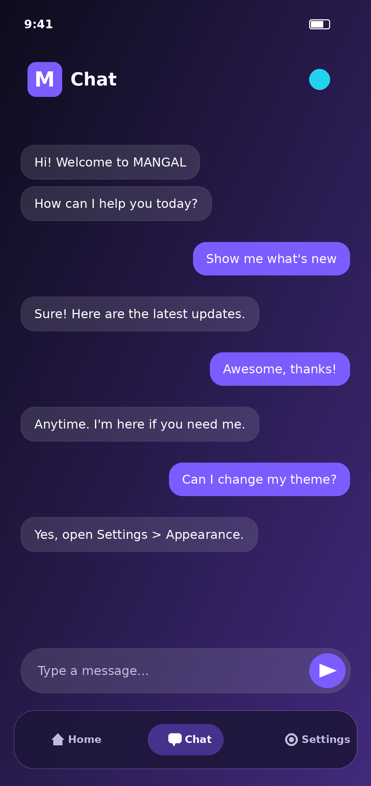
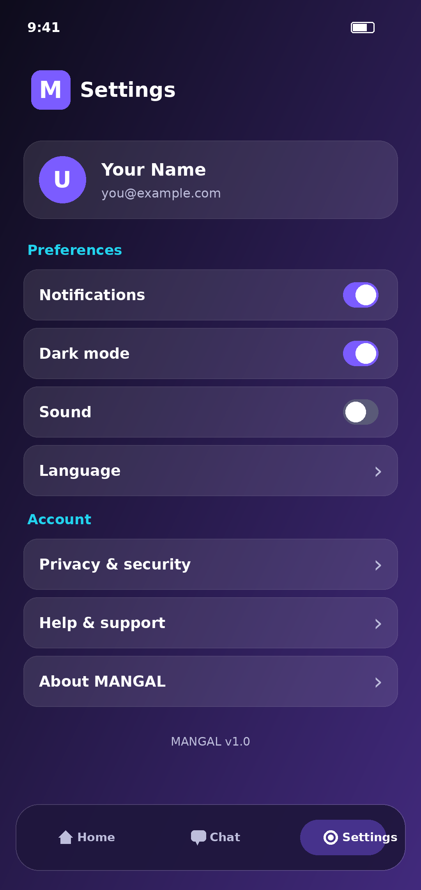

<div align="center">

# 🪔 MANGAL

### *Your new offline Agent*

**An AI agent that lives on your device — private, fast, and always available, even without internet.**

<br/>


<br/>

[✨ Features](#-features) •
[📱 Screenshots](#-screenshots) •
[🛠️ Tech Stack](#️-tech-stack) •
[🚀 Getting Started](#-getting-started) •
[🗂️ Structure](#️-project-structure) •
[🤝 Contributing](#-contributing)

</div>

---

## 🌟 What is MANGAL?

**MANGAL** is an **offline-first AI agent** built to help you get things done without depending on a constant connection. It pairs a modern React web interface with a native **Android** wrapper, so the same experience works in the browser and on your phone.

> 💡 **Mangal (मंगल)** — meaning *auspicious*, a fresh and positive beginning.

---

## ✨ Features

- 🔌 **Offline-first** — designed to keep working when the network doesn't
- 🤖 **Agent-style assistant** — ask, instruct, and get answers in a clean chat interface
- 📱 **Android app** — ships with an `android-mangal` project for on-device use
- 🎨 **Polished UI** — responsive layout with smooth animations and crisp icons
- ⚡ **Fast by default** — powered by Vite for instant dev feedback and lean builds
- 🔐 **Config via `.env`** — keep keys and settings out of your source code

<!-- TODO: replace/extend with MANGAL's real capabilities (e.g. voice, local knowledge base, tools) -->

---

## 📱 Screenshots

<div align="center">

| Home | Chat | Settings |
| :---: | :---: | :---: |
|  |  |  |

</div>

> 📸 Add your screenshots to a `screenshots/` folder and update the paths above.

---

## 🛠️ Tech Stack

| Layer | Technology |
| :--- | :--- |
| **Frontend** | React 19, TypeScript |
| **Build tool** | Vite |
| **Styling** | Tailwind CSS 4 |
| **UI extras** | Motion (animations), Lucide (icons) |
| **AI SDK** | Google GenAI SDK (`@google/genai`) |
| **Server utilities** | Express, dotenv |
| **Mobile** | Android (`android-mangal`) |
| **CI/CD** | GitHub Actions |

---

## 🚀 Getting Started

### 📋 Prerequisites

- [Node.js](https://nodejs.org/) 18 or newer
- npm
- *(Android only)* [Android Studio](https://developer.android.com/studio) and JDK 17+

### 💻 Run the web app

```bash
# 1. Clone the repository
git clone https://github.com/BidhanKumarPaul/MANGAL.git
cd MANGAL

# 2. Install dependencies
npm install

# 3. Set up environment variables
cp .env.example .env
# then open .env and fill in your values

# 4. Start the dev server
npm run dev
```

Open **http://localhost:3000** in your browser. 🎉

### 📱 Run the Android app

1. Open the `android-mangal/` folder in **Android Studio**
2. Let Gradle sync
3. Pick a device or emulator and hit **Run ▶️**

### 📜 Available scripts

| Command | What it does |
| :--- | :--- |
| `npm run dev` | Start the dev server on port 3000 |
| `npm run build` | Create a production build |
| `npm run preview` | Preview the production build locally |
| `npm run lint` | Type-check with TypeScript |
| `npm run clean` | Remove build output |

---

## 🗂️ Project Structure

```
MANGAL/
├── android-mangal/        # Native Android project
├── public/                # Static assets
├── scripts/               # Helper scripts
├── src/                   # React + TypeScript source
├── .github/workflows/     # CI/CD pipelines
├── index.html             # App entry point
├── vite.config.ts         # Vite configuration
├── tsconfig.json          # TypeScript configuration
├── package.json           # Dependencies & scripts
└── .env.example           # Environment variable template
```

---

## 🗺️ Roadmap

- [x] Web interface (React + Vite)
- [x] Android project setup
- [ ] Release first APK
- [ ] Expand offline capabilities
- [ ] Add more agent tools and skills

---

## 🤝 Contributing

This is currently a solo project, but ideas and issues are very welcome!

1. 🍴 Fork the repo
2. 🌿 Create a feature branch: `git checkout -b feature/amazing-feature`
3. 💾 Commit your changes
4. 🚀 Open a pull request

---

## 📄 License

Add a `LICENSE` file to define how others can use this project (MIT is a common choice).

---

<div align="center">

**Built with ❤️ by [Bidhan Kumar Paul](https://github.com/BidhanKumarPaul) · BKP IT**

If MANGAL is useful to you, consider giving it a ⭐

</div>
